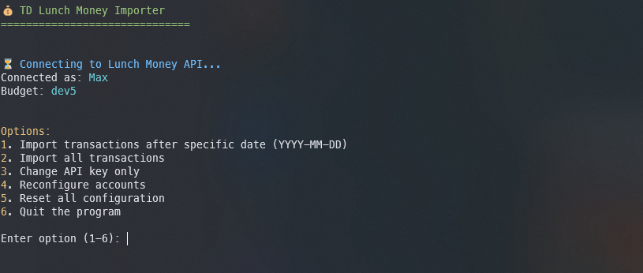
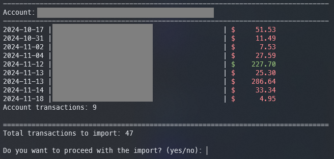
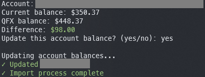
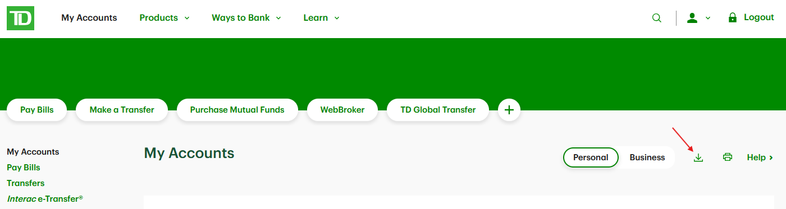
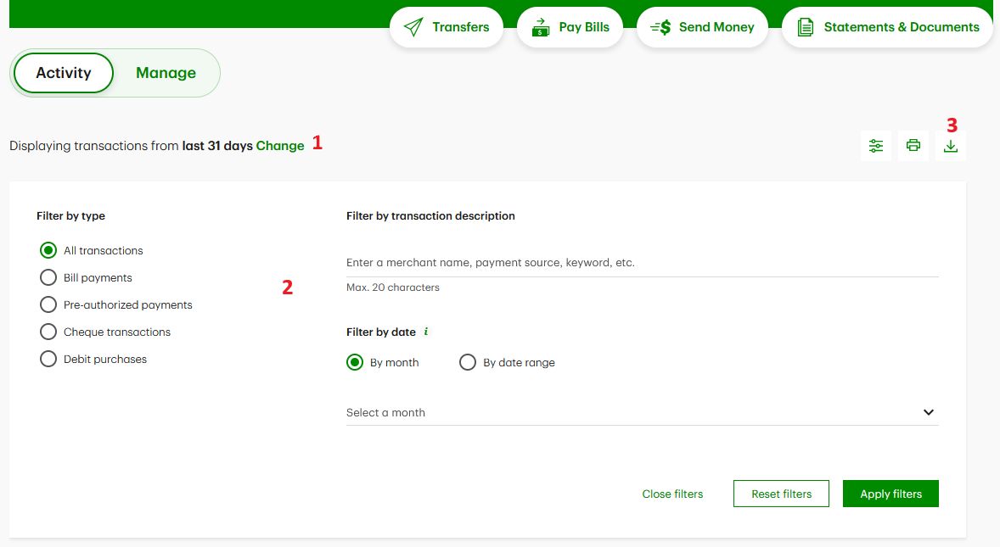
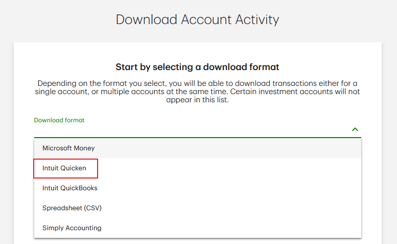

# TD -> Lunch Money Importer

[](https://github.com/thehedgefrog/td-lunchmoney-importer/actions/workflows/build.yml)
[](https://github.com/thehedgefrog/td-lunchmoney-importer/actions/workflows/ci.yml)
[](https://github.com/thehedgefrog/td-lunchmoney-importer/releases/latest)

Import TD Canada Trust QFX files into [Lunch Money](https://lunchmoney.app).

## Features

- Import transactions from TD QFX files (including those with multiple accounts)
- Match TD accounts to Lunch Money accounts
- Filter transactions by date
- Update account balances
- Persistent configuration
- Duplicate detection

### Screenshots




## Installation

### From Releases
Download the latest release for your platform:
- [Windows (x64)](https://github.com/thehedgefrog/td-lunchmoney-importer/releases/latest/download/td-lunchmoney-importer-windows-x64.exe)
- [macOS (Apple Silicon - ARM64)](https://github.com/thehedgefrog/td-lunchmoney-importer/releases/latest/download/td-lunchmoney-importer-macos-arm64)
- [Linux (x64)](https://github.com/thehedgefrog/td-lunchmoney-importer/releases/latest/download/td-lunchmoney-importer-linux-x64)

### From Source
Read the Usage instructions and then [install from source](#using-from-source).

## Usage
1. Get your Lunch Money API key from [Developer Settings](https://my.lunchmoney.app/developers)
2. [Get your QFX file](#downloading-td-qfx-files) from TD.
3. Run the importer:
   1. On the GUI, launch the executable and type the path to your QFX file. Alternatively, you can drag and drop your QFX file on the executable.
   2. From the command line, make the binary executable and launch it with a path to your QFX file:
      ```
      ./td-lunchmoney-importer path/to/file.qfx
      ```

4. On first run:
   - Enter your API key
   - Match your TD accounts to Lunch Money accounts
5. For subsequent runs:
   - Choose date filter (optional)
   - Review transactions
   - Confirm import
   - Update balances if needed

### Downloading TD QFX Files
1. From the main EasyWeb page, click the Download button. This will let you select any of your accounts in a single file.


2. Alternatively, from any of your accounts, filter the dates as needed and then click the Download button to get a file containing that date range.


3. Ensure you select **Intuit Quicken** as the file format.



### Security
TD Lunch Money Importer stores your API key securely in your system's credentials store:
- Windows: Windows Credential Manager
- macOS: Keychain
- Linux: Secret Service API/libsecret

Account mappings are stored separately in `~/.lunchmoney/config.json`.

### Log Files
Log files are stored in `~/.lunchmoney/logs/importer.log` and rotated automatically:
- Maximum size: 1MB per file
- Keeps 5 most recent log files

### Dependencies
- Python 3.9+
- ofxparse
- lunchable
- colorama
- keyring

### Using From Source
```bash
git clone https://github.com/thehedgefrog/td-lunchmoney-importer.git
cd td-lunchmoney-importer
pip install -r requirements.txt
python importer.py myfile.qfx
```
Where `myfile.qfx` is the path to a valid QFX.

### Running Tests
```bash
python -m unittest discover -s tests -p "test_*.py" -v
```

### CI and Release Gates
- Pull requests and pushes to `main` run CI on Python 3.9 and 3.11.
- CI runs compile/import smoke checks and unit tests.
- Release builds run pre-release checks first and only publish binaries if checks pass.
- Version tags must match `lunchmoney.__version__` (for example: tag `v1.0.0` requires `__version__ = "1.0.0"`).

### Release Checklist
- Update version in `lunchmoney/__init__.py` (`__version__ = "X.Y.Z"`)
- Ensure CI is green on `main`
- Create and push tag `vX.Y.Z`
- Create GitHub Release from tag `vX.Y.Z`
- Verify build workflow publishes 3 assets:
   - Windows x64 `.exe`
   - macOS ARM64 binary
   - Linux x64 binary

### Contributing
1. Fork the repository
2. Create your feature branch (`git checkout -b feature/AmazingFeature`)
3. Commit your changes (`git commit -m 'Add some AmazingFeature'`)
4. Push to the branch (`git push origin feature/AmazingFeature`)
5. Open a Pull Request

### License
Distributed under the MIT License. See `LICENSE` for more information.