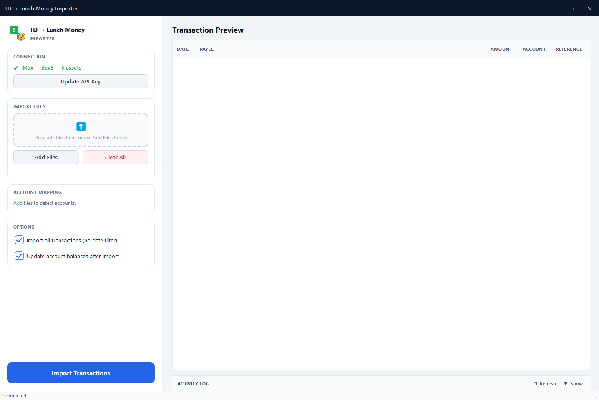

# TD -> Lunch Money Importer

[](https://github.com/thehedgefrog/td-lunchmoney-importer/actions/workflows/build.yml)
[](https://github.com/thehedgefrog/td-lunchmoney-importer/actions/workflows/ci.yml)
[](https://github.com/thehedgefrog/td-lunchmoney-importer/releases/latest)

Import TD Canada Trust QFX files into [Lunch Money](https://lunchmoney.app).



### What's New in v2.0

- GUI-first experience
- Optional CLI mode via `--cli`
- Multi-file QFX import queue with drag-and-drop
- Account mapping wizard
- Transaction preview table before import
- Optional date filtering
- Optional post-import account balance updates
- In-app activity log panel

## Features

- Import one or more TD QFX files
- Handle files containing multiple accounts
- Map TD accounts to Lunch Money assets
- Detect and support newly seen accounts
- Preview transaction count and totals before import
- Duplicate handling via Lunch Money API response
- Save API key securely in system credential storage
- Persist account mappings between runs

## Installation

### From Releases

Download the latest release for your platform:

- Windows (x64): https://github.com/thehedgefrog/td-lunchmoney-importer/releases/latest/download/td-lunchmoney-importer-windows-x64.exe
- Linux (x64): https://github.com/thehedgefrog/td-lunchmoney-importer/releases/latest/download/td-lunchmoney-importer-linux-x64

#### macOS (Run from Source)

Due to Apple restrictions around non-paid developer accounts, there is currently no pre-built macOS executable. Macs are supported, both on Apple Silicon and Intel, if the app is run from source. To run on macOS, use the following steps:

```bash
git clone https://github.com/thehedgefrog/td-lunchmoney-importer.git
cd td-lunchmoney-importer
python3 -m venv .venv
source .venv/bin/activate
pip install -r requirements.txt
python importer.py
```

You can launch the GUI or use CLI mode as described below. All features are available when running from source on macOS.

### From Source

```bash
git clone https://github.com/thehedgefrog/td-lunchmoney-importer.git
cd td-lunchmoney-importer
pip install -r requirements.txt
```

## Usage


### Default (GUI)
- **Windows/Linux:** Launch the executable, or drag and drop a QFX file onto it to load automatically at startup.
- **macOS:** Run `python importer.py` from the project directory (see above for setup). You can also pass QFX files as arguments.

Run without flags to launch the GUI:

```bash
python importer.py
```

You can also pass one or more QFX files directly:

```bash
python importer.py /path/to/file1.qfx /path/to/file2.qfx
```


### CLI Mode (forced)

Use --cli to run the terminal flow explicitly:

```bash
python importer.py --cli
```

Or provide a file:

```bash
python importer.py --cli /path/to/file.qfx
```


## Workflow

1. Connect with your Lunch Money API key (stored securely)
2. Add QFX files (file picker or drag-and-drop)
3. Confirm or edit account mappings
4. Optionally set a date filter (or import all transactions)
5. Review preview table and totals
6. Click Import Transactions
7. Optionally update balances after import

### CLI Workflow

1. Start with --cli (with or without a QFX path)
2. Enter API key if needed
3. Complete account mapping if prompted
4. Choose date filtering options
5. Review transactions in terminal
6. Confirm import

### Downloading TD QFX Files
1. From the main EasyWeb page, click the Download button. This will let you select any of your accounts in a single file.


2. Alternatively, from any of your accounts, filter the dates as needed and then click the Download button to get a file containing that date range.


3. Ensure you select **Intuit Quicken** as the file format.


### Security
TD Lunch Money Importer stores your API key securely in your system's credentials store:
- Windows: Windows Credential Manager
- macOS: Keychain
- Linux: Secret Service API/libsecret

Account mappings are stored separately in `~/.lunchmoney/config.json`.

### Log Files
Log files are stored in `~/.lunchmoney/logs/importer.log` and rotated automatically:
- Maximum size: 1MB per file
- Keeps 5 most recent log files

### Dependencies

- Python 3.9+
- ofxparse
- lunchable
- colorama
- keyring
- PySide6

### License

Distributed under the MIT License. See `LICENSE` for details.
